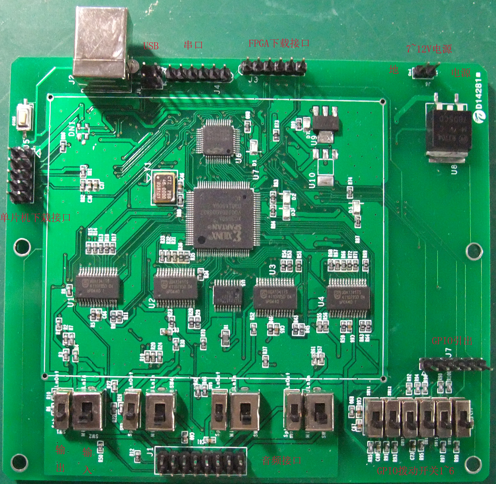

# A FGPA based 8x8 audio mixer

# The projects contains:
* 80C81   Silicon lab firmware to manage FPGA and handle USB user input/output
* FPGA_CODE  Verilog codes to mix digital audio from UDA1341
* AudioMixer  Windows software to manage the mix scheme
